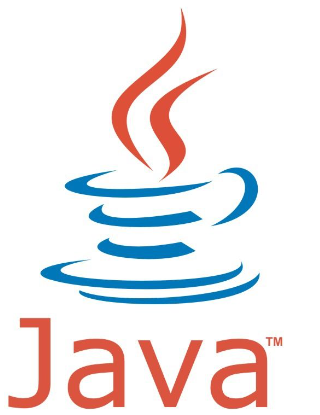

# Reading-notes
This repo will include my knowledge in Java Software development training at ASAC.
## Code 401 - Advanced Software Development
## Table of Contents
### Prep work
- [SQL Practice](topics/SQL-Practice.md)
- [Terminal Practice ](topics/Terminal-Practice.md)
- [The Growth Mindset ](topics/The-Growth-Mindset.md)
### Discussions
- [DataStuctures & Big O ](topics/Discussions/DataStucture.md) 
- [Engineering-Readings](topics/Discussions/Engineering-Readings.md) 

| Class name  | Class reading & preparation| Class lab     | class code chalenge  |
| --------------- | --------------- | --------------- | --------------- |
| Class 01  |[Class 01 -Java introduction ](topics/Readings/class01.md) | [java-fundamentals](https://github.com/NaserGharbieh/java-fundamentals)  | [Array-reverse](https://nasergharbieh.github.io/data-structures-and-algorithms/codeChallenge1/arrayreverse.html)  |
| Class 02  | [Class 02:Packages ,Loops and Arrays ](topics/Readings/class02.md)  | [Class 02 lab ](url6)  | [Class 02 CC ](url6)  |
| Class 03  | [Class 03:Primitives vs Objects ,Exceptions and Scanner. ](topics/Readings/class03.md)  | [Class 03 lab ](url6)  | [Class 03 CC ](url6)  |
| Class 04 | [Class 04: OOP ](topics/Readings/class04.md)  | [Class 04 lab ](url6)  | [Class 04 CC ](url6)  |
| Class 05 | [Class 05: Big O and Linked Lists ](topics/Readings/class05.md)  | [Class 05 lab ](url6)  | [Class 05 CC ](url6)  |
| Class 06 | [Class 05: Big O and Linked Lists ](topics/Readings/class06.md)  | [Class 06 lab ](url6)  | [Class 06 CC ](url6)  |

## Things I want to know more about 

  
  
  

