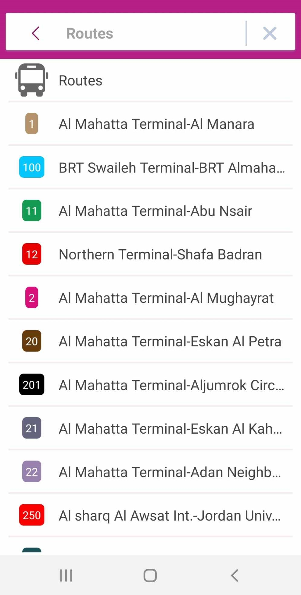

# Class 28 reading: RecyclerView

## What Makes a RecyclerView Dynamic

- A `RecyclerView` is dynamic because it efficiently displays large sets of data while reusing individual elements as they scroll on and off the screen.

-  Instead of destroying views for items that scroll off the screen, `RecyclerView` reuses them for new items that come on-screen. 

- This recycling mechanism significantly improves performance, app responsiveness, and reduces power consumption when compared to less dynamic approaches.

## I like to share thr Amman bus app that uses RecyclerView to display Routes

