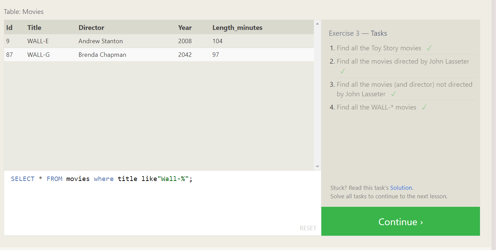
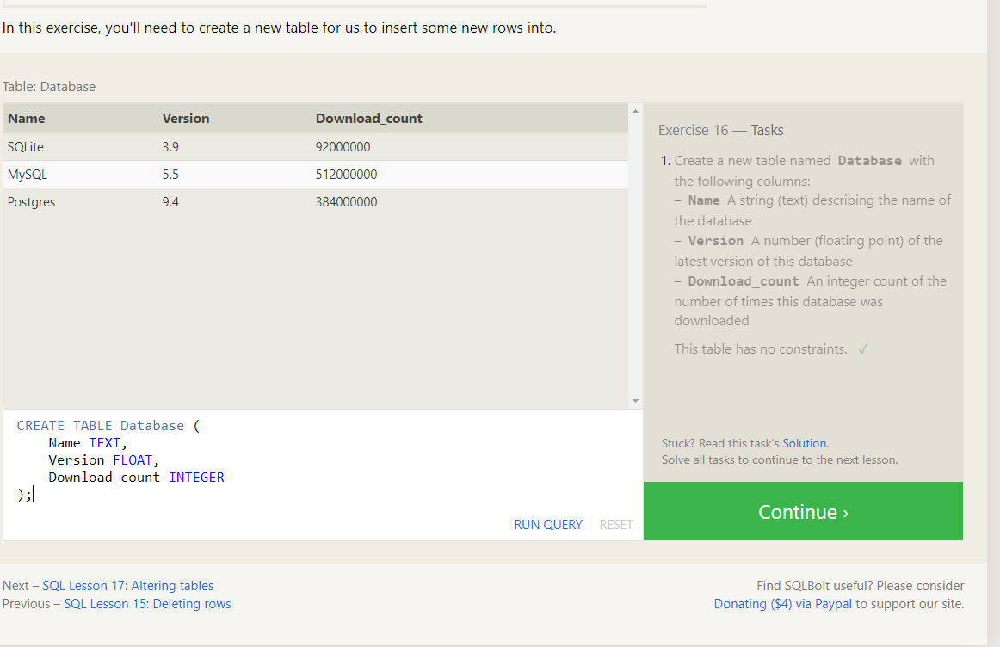

# SQL Practice
## summary of sql practice :
- Relational database represents a collection of    related (two-dimensional) tables.with a fixed number of columns (the attributes or properties of the table) and any number of rows of data. 

- SQL (Structured Query Language) is a programming language used to manage and manipulate data in relational databases.
- SQL provides a standardized way to interact with relational databases. **It offers various commands, such as SELECT, INSERT, UPDATE, and DELETE, which allow users to query and modify data.** 
- SQL statements can be used to **create, modify, and delete tables**, as well as to perform advanced operations like **joining tables, filtering data, and aggregating information**. 
- In summary, relational databases organize data into tables with predefined relationships, and SQL is used to interact with and manipulate data in these databases. Together, they provide a powerful and reliable solution for managing and querying structured data. 
## SQLBolt Practice

In this section, you will find practice lessons for SQLBolt.

## Lesson 1

## Lesson 2

## Lesson 3

## Lesson 4

## Lesson 5

## Lesson 6

## Lesson 13

## Lesson 14

## Lesson 15

## Lesson 16

## Lesson 17

## Lesson 18

